`Moh Oktavi Aziz Nugraha` `3 D3 IT-A LA` `3121521017`

# Latihan Modul GIS04 🌏

1. Jalankan ArcMap dan buat sebuah dokumen peta baru. Beri nama dokumen peta anda nrp_bab01.mxd!

   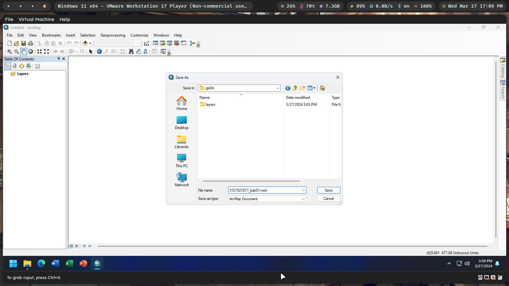

2. Tambahkan layer sungai, airport, kabupaten, dan kecamatan!

   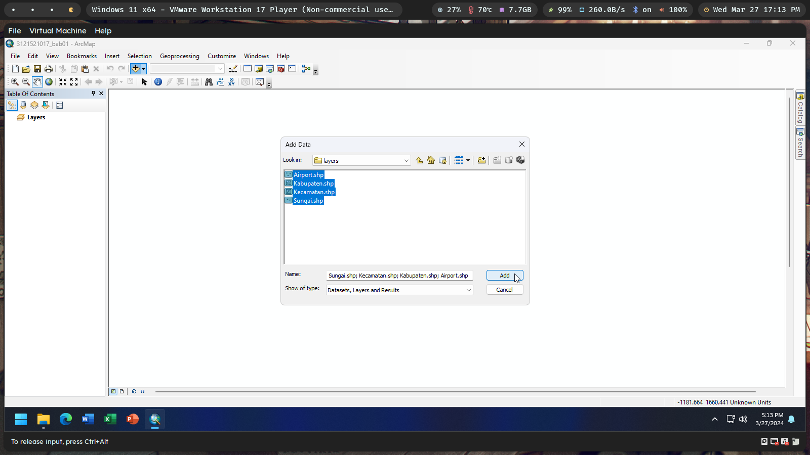

3. Atur urutan layer menjadi kabupaten->kecamatan->sungai->airport!

   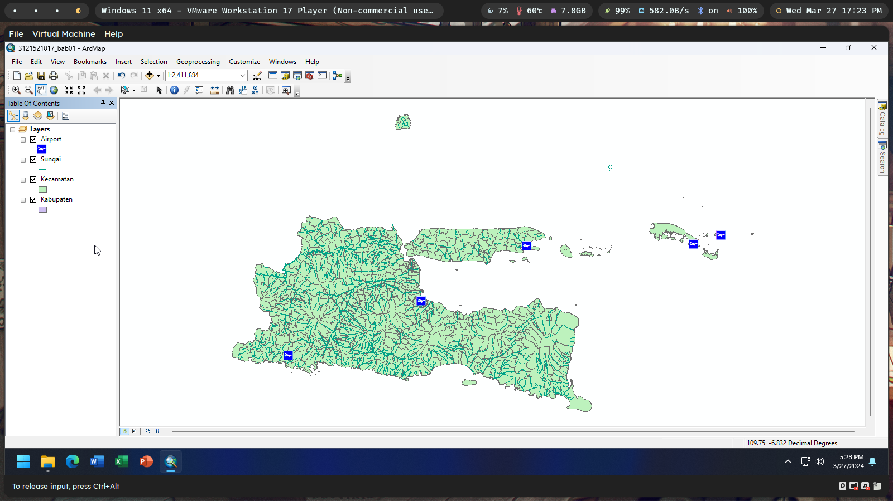

4. Ubah properti dari dokumen peta anda sehingga menggunakan relative path untuk lokasi sumber-sumber datanya!

   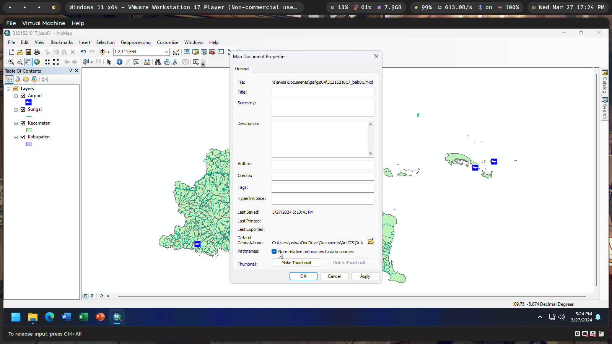

5. Sembunyikan layer kecamatan sehingga yang tampil hanya layer kabupaten, sungai, dan airport!

   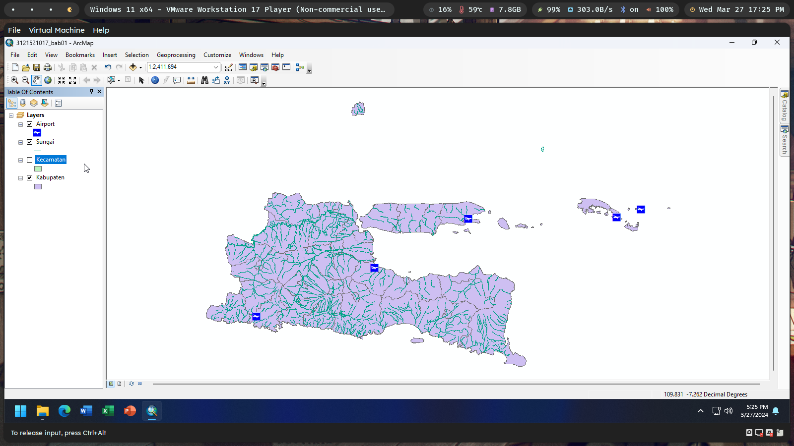

6. Atur tampilan dari peta sehingga pulau Madura berada di tengah layar. Kemudian buat sebuah spatial bookmark dan beri nama “Madura”!

   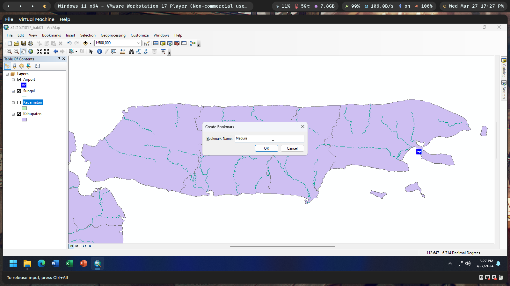

7. Aktifkan tool Overview Window!

   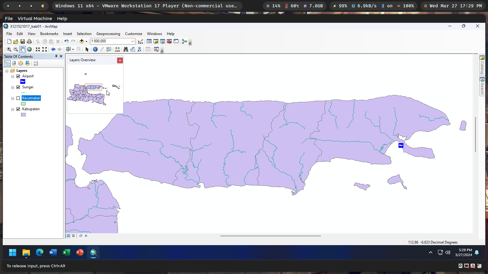

8. Klik tombol Full Extent , kemudian klik spatial bookmark “Madura” yang telah anda buat pada langkah sebelumnya!

   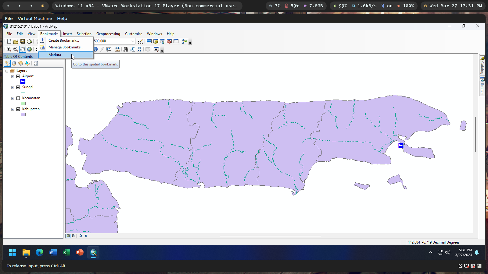

9. Hitung panjang pulau Madura!

   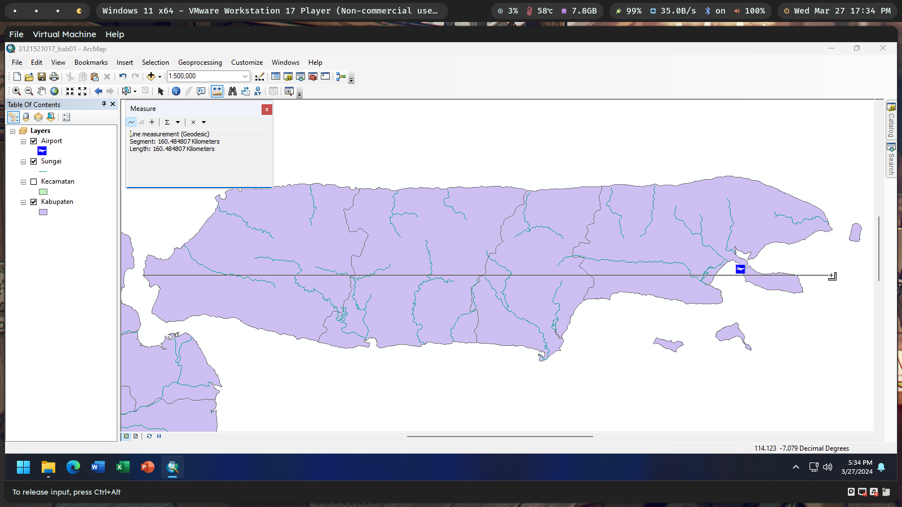

10. Dengan menggunakan tool Identify, carilah luas dan keliling dari kabupaten Lamongan!

    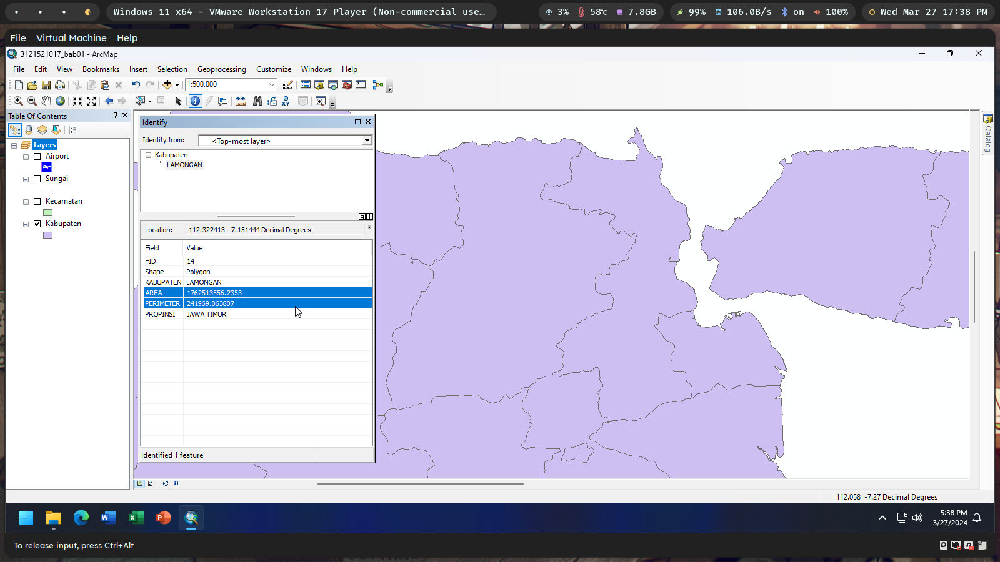

11. Carilah semua kabupaten yang mempunyai kecamatan dengan nama “Kauman”!

    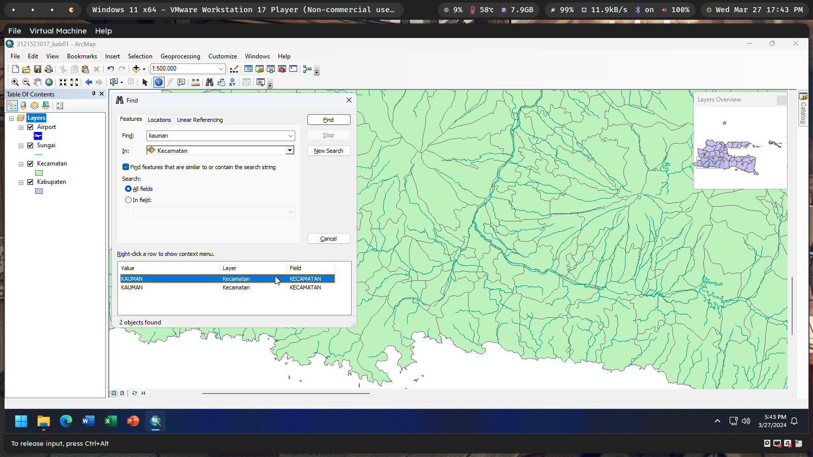

12. Pada dokumen peta anda, aturlah supaya fitur terpilih pada layer kabupaten yang terpilih berwarna merah muda sedangkan fitur terpilih pada layer kecamatan mempunyai garis tepi berwarna hijau.

    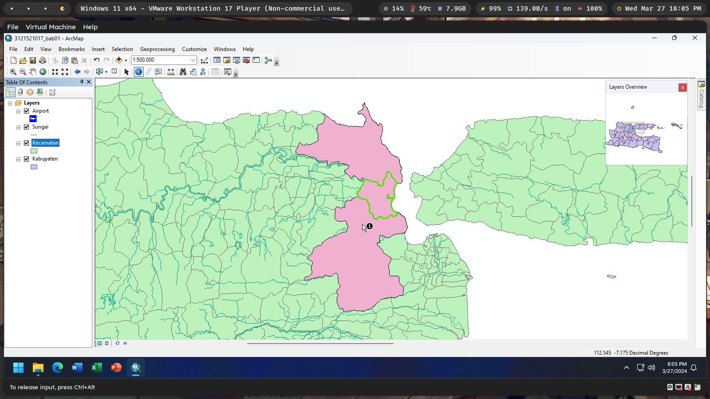
