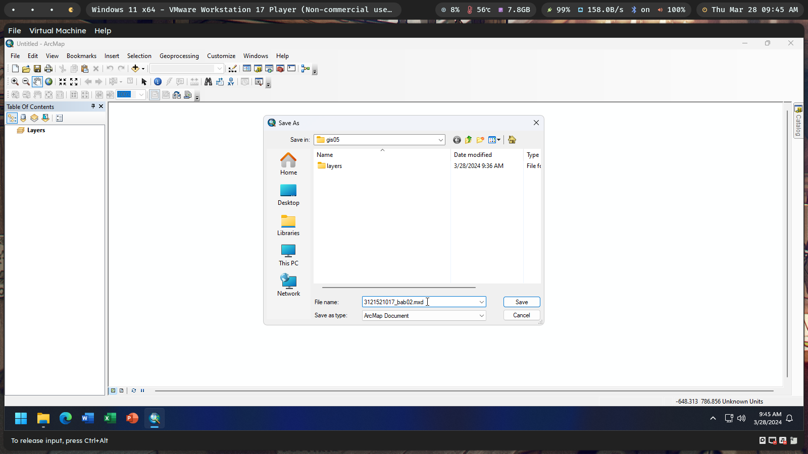
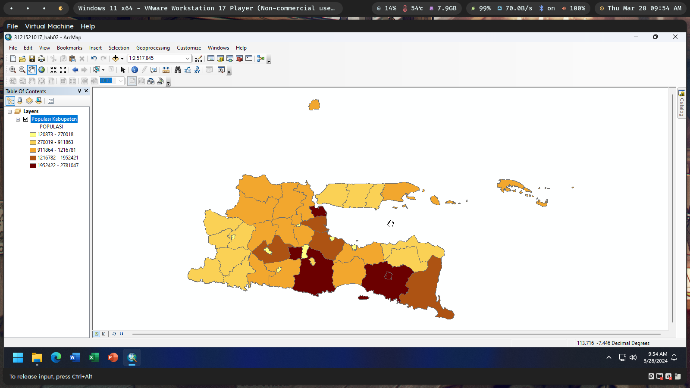
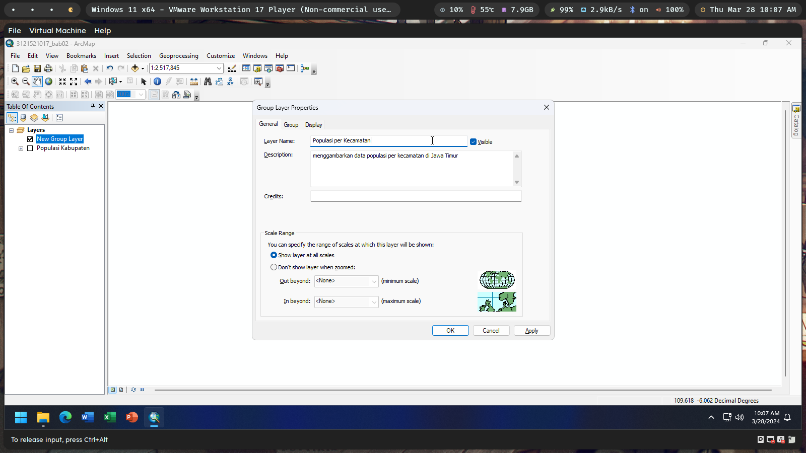
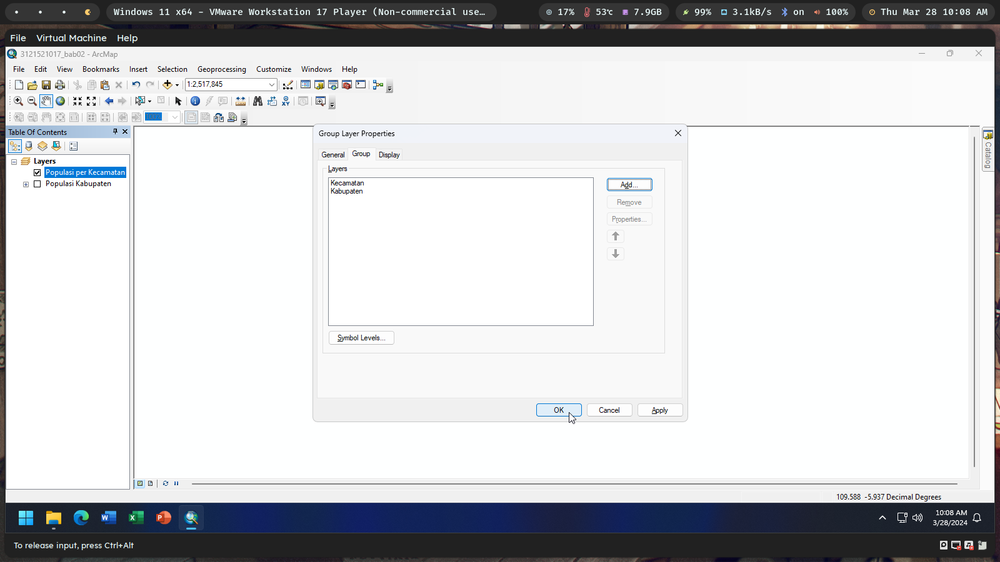
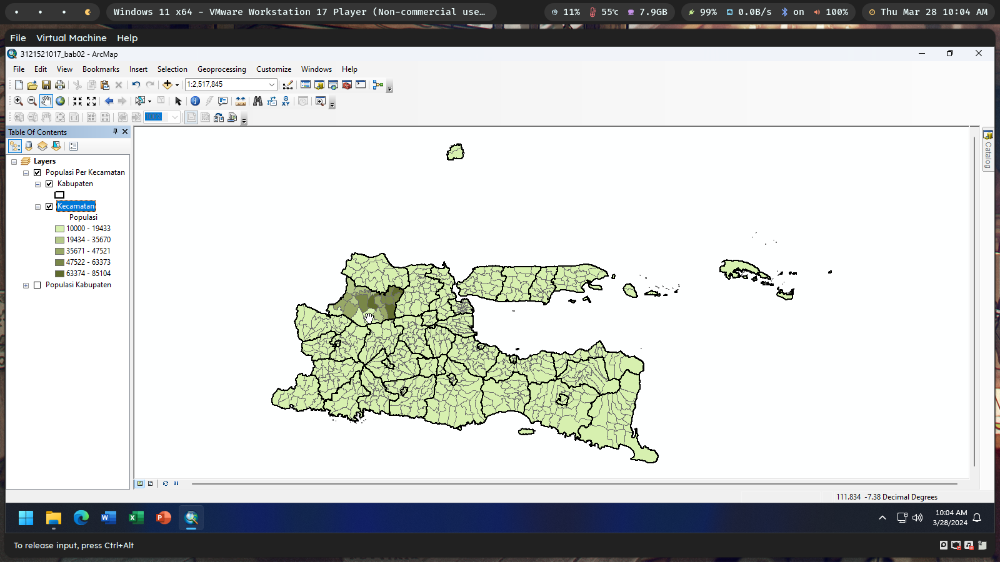
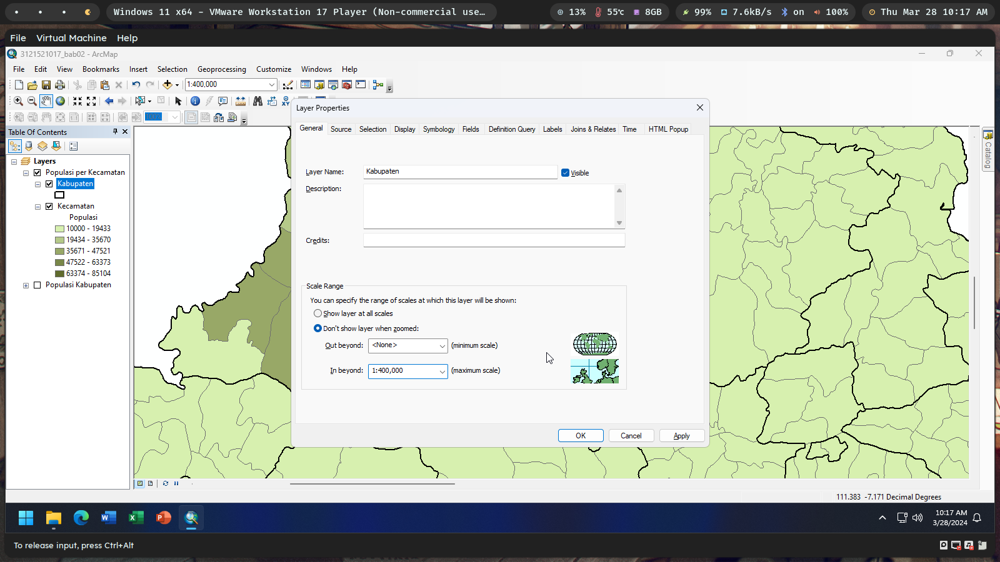
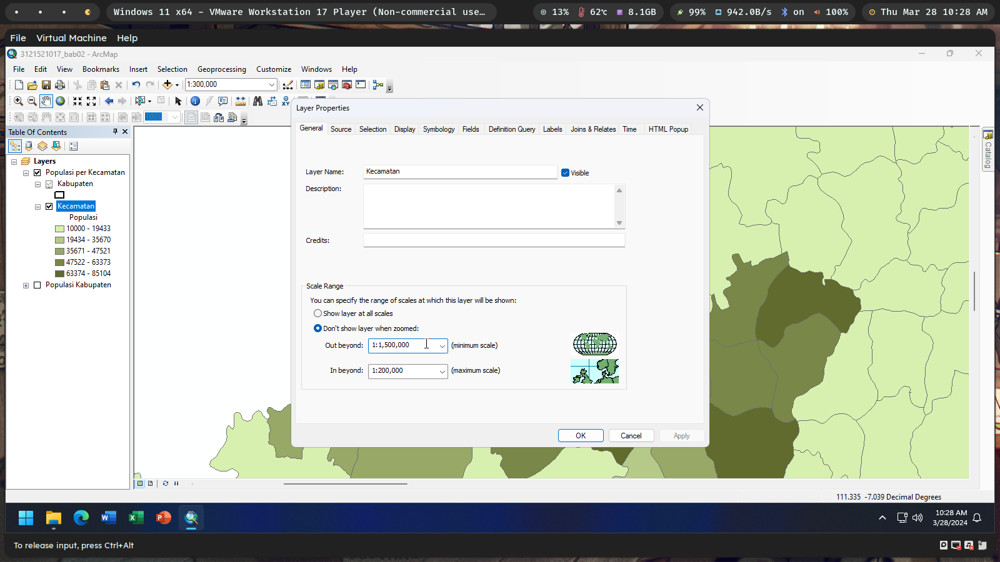
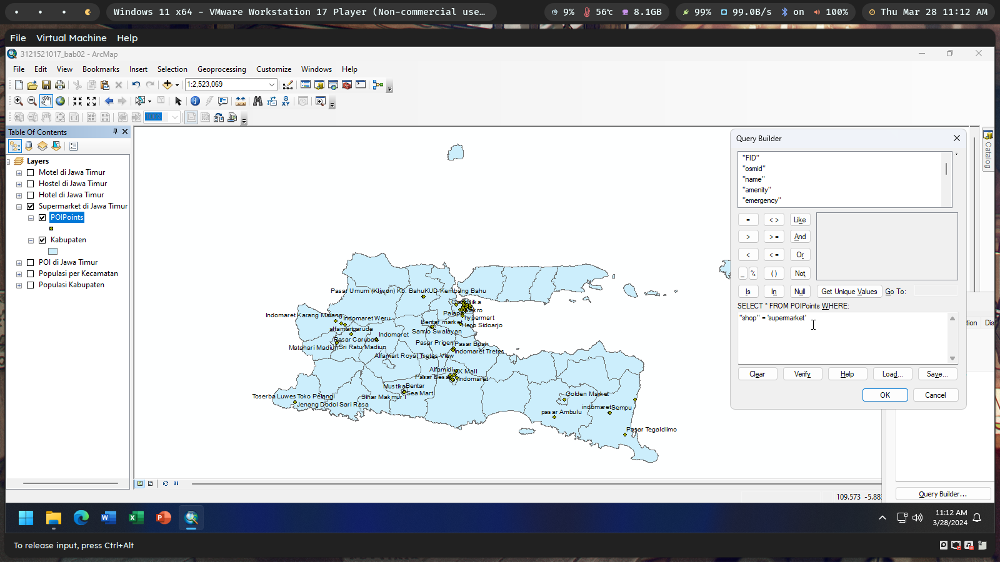
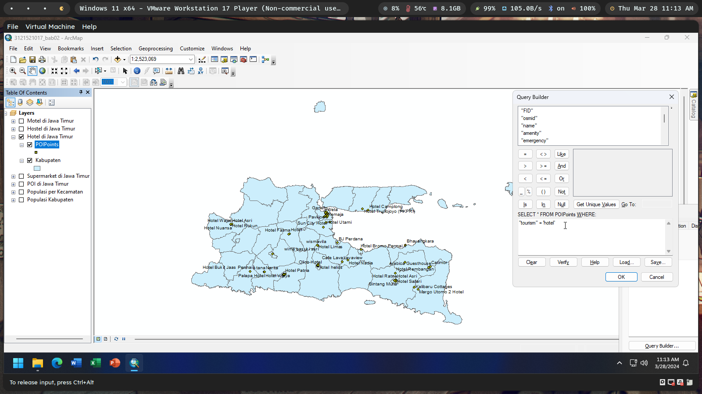
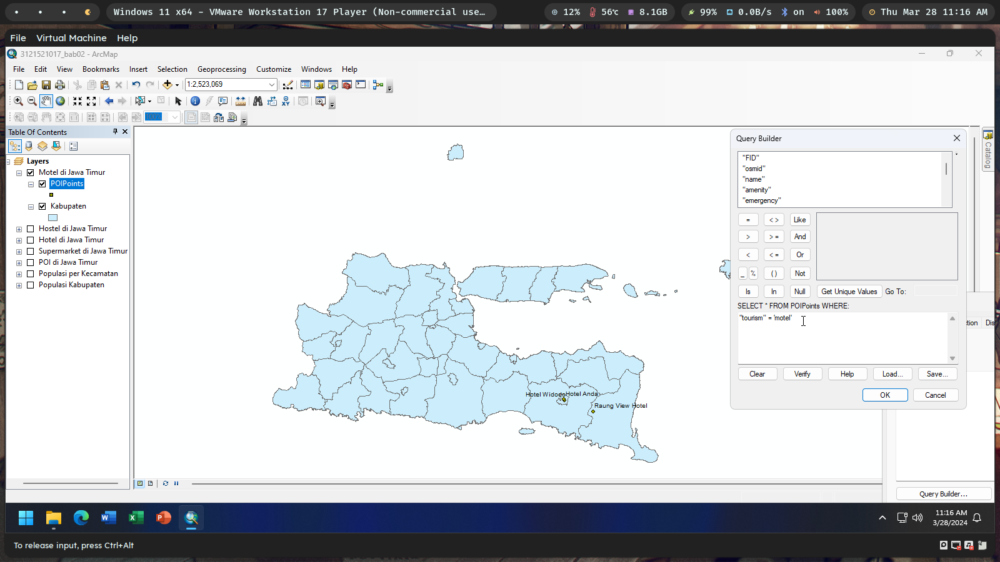

`Moh Oktavi Aziz Nugraha` `3 D3 IT-A LA` `3121521017`

# Latihan Modul GIS05 🌏

1. Jalankan ArcMap dan buat sebuah dokumen peta baru. Beri nama dokumen
   peta anda nrp_bab02.mxd!

   

2. Buatlah sebuah peta Choropleth untuk populasi penduduk di kabupaten-
   kabupaten di Jawa Timur

   

3. Buatlah sebuah Group Layer dan beri nama “Populasi per Kecamatan”

   

4. Tambahkan layer peta tematik Kabupaten.shp dan Kecamatan.shp pada Group
   Layer yang telah anda buat pada langkah sebelumnya

   

5. Buat peta Choropleth untuk populasi penduduk di kecamatan-kecamatan di
   Jawa Timur

   

6. Atur supaya layer Kabupaten tidak tampil ketika skala peta lebih besar
   dari 1:400.000

   

7. Atur supaya layer Kecamatan hanya tampil pada skala peta antara
   1:1.500.000 dan 1:200.000

   

8. Buatlah sebuah Group Layer baru dan beri nama “Supermarket di Jawa
   Timur”. Tambahkan beberapa layer peta tematik dan buatlah peta titik
   untuk semua supermarket di Jawa Timur. Lakukan navigasi peta seperlunya.

   

9. Ulangi lagi soal no 9 untuk membuat peta titik semua hotel, hostel, dan
   motel di seluruh Jawa Timur.

   - Hotel

     

   - Hostel

     

   - Motel

     
