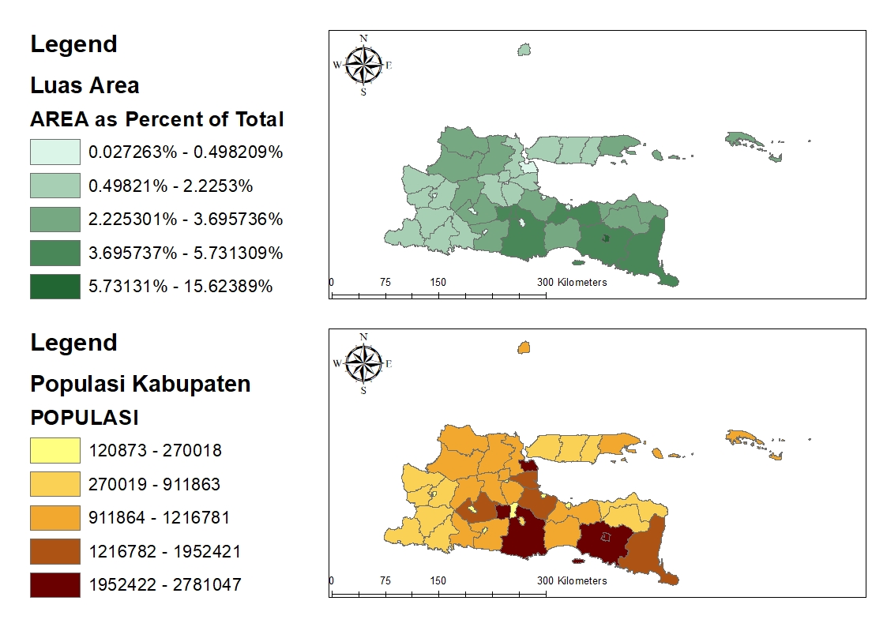

`Moh Oktavi Aziz Nugraha` `3 D3 IT-A LA` `3121521017`

# Latihan Modul GIS05 🌏

1. Jalankan ArcMap.

   

2. Buka dokumen peta yang telah anda buat pada latihan bab 2. Simpan dokumen
   peta anda sebagai nrp_bab03a.mxd!

   

3. Buatlah layout peta yang menampilkan populasi per kabupaten di Jawa Timur
   lengkap dengan legenda, arah utara peta, dan batang skala.

   

4. Simpan dokumen peta anda sebagai nrp_bab03b.mxd!

   

5. Buatlah layout peta yang menampilkan dua peta, yaitu: “Populasi per
   Kabupaten” dan “Luas Area” untuk seluruh kabupaten di Jawa Timur.
   Tambahkan legenda, batang skala, dan arah utara peta.

   

6. Buka dokumen peta nrp_bab03a.mxd anda!

   

7. Tambahkan laporan yang menampilkan 7 kabupaten dengan populasi
   terbanyak!

   

8. Simpan dokumen peta anda sebagai nrp_bab03c.mxd!

   
