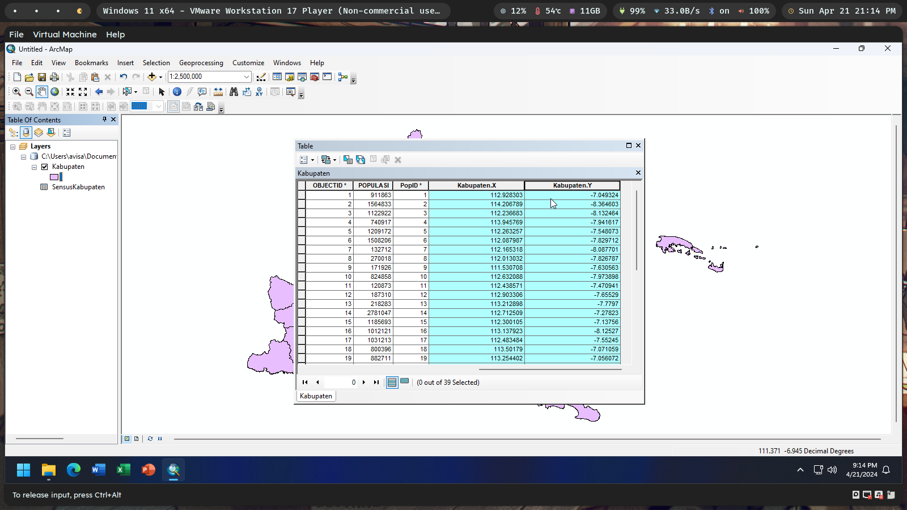

`Moh Oktavi Aziz Nugraha` `3 D3 IT-A LA` `3121521017`

# Latihan Modul GIS08 🌏

1. Jalankan ArcCatalog kemudian buat sebuah file geodatabase baru. Beri nama
   file geodatabase tersebut nrp_Jawa_Timur.gdb!

   

2. Masukkan (impor) file peta Kabupaten.shp, Kecamatan.shp, POIPoint.shp, dan
   Sungai.shp kedalam file geodatabase anda!

   

3. Masukkan (impor) file tabel SensusKabupaten.dbf kedalam file geodatabase
   anda!

   

4. Padatkan (compress) file geodatabase anda!

   

5. Buatlah dokumen peta baru, tambahkan layer “Kabupaten” dan
   “SensusKabupaten” dari file geodatabase anda!

   

6. Gabungkan (join) layer “Kabupaten” dengan layer “SensusKabupaten”!

   

7. Tambahkan koordinat titik pusat (centroid) pada tabel data atribut dari layer
   “Kabupaten” anda!

   

8. Ekspor tabel data atribut yang telah berisi koordinat pusat. Simpan hasil ekspor
   di dalam file geodatabase anda dan beri nama “nrp_Kota”!

   

9. Buat sebuah feature class baru berdasarkan feature class “nrp_Kota” yang telah
   anda buat pada latihan no 8!

   

10. Buatlah peta choropleth untuk luas area wilayah kabupaten dan peta Graduated
    Symbol untuk populasi per kabupaten di Jawa Timur!

    
