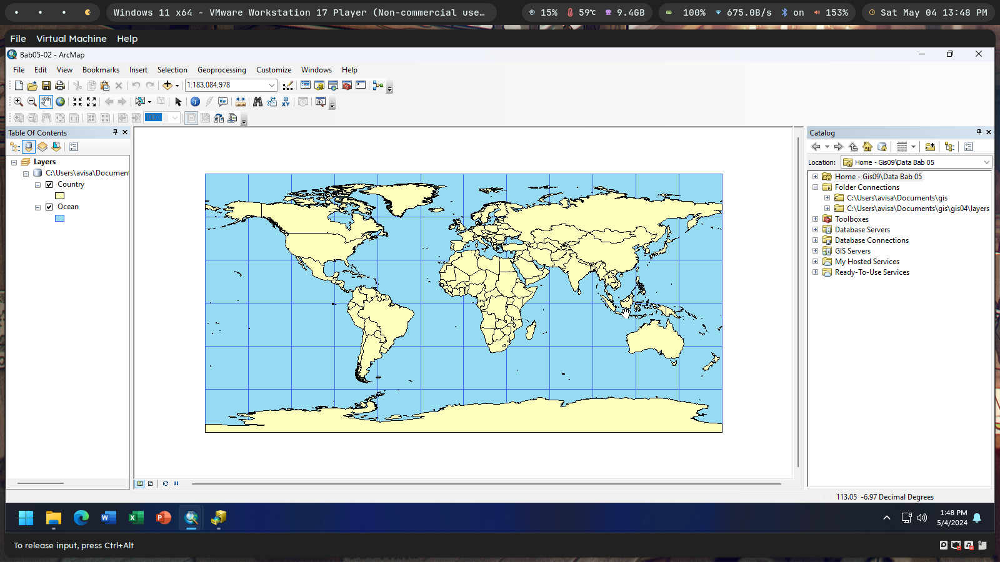

`Moh Oktavi Aziz Nugraha` `3 D3 IT-A LA` `3121521017`

# Latihan Modul GIS09 🌏

### Daftar Isi

<!--toc:start-->
- [5.1 Memahami Metadata](#51-memahami-metadata)
  - [5.1.1 Ketidak-cocokan antar peta!](#511-ketidak-cocokan-antar-peta)
  - [5.1.2 Membuka file metadata](#512-membuka-file-metadata)
- [5.2 Bekerja dengan Proyeksi Peta](#52-bekerja-dengan-proyeksi-peta)
  - [5.2.1 Mengatur proyeksi peta](#521-mengatur-proyeksi-peta)
  - [5.2.2 Merubah proyeksi peta ke Mercator](#522-merubah-proyeksi-peta-ke-mercator)
  - [5.2.3 Mengatur proyeksi peta untuk wilayah Amerika Serikat](#523-mengatur-proyeksi-peta-untuk-wilayah-amerika-serikat)
  - [5.2.4 State plane coordinate system](#524-state-plane-coordinate-system)
  - [5.2.5 Menambahkan layer dengan proyeksi state plane ke dokumen peta](#525-menambahkan-layer-dengan-proyeksi-state-plane-ke-dokumen-peta)
  - [5.2.6 Ketidak-cocokan antar peta!](#526-ketidak-cocokan-antar-peta)
  - [5.2.7 Mengatur proyeksi peta pada shapefile](#527-mengatur-proyeksi-peta-pada-shapefile)
- [5.3 Format Data Vektor](#53-format-data-vektor)
  - [5.3.1 Shapefile](#531-shapefile)
  - [5.3.2 Coverage](#532-coverage)
  - [5.3.3 Menambahkan data coverage ke dalam ArcMap](#533-menambahkan-data-coverage-ke-dalam-arcmap)
  - [5.3.4 Merubah coverage menjadi shapefile](#534-merubah-coverage-menjadi-shapefile)
  - [5.3.5 File CAD](#535-file-cad)
  - [5.3.5 File CAD](#535-file-cad)
  - [5.3.6 Menambahkan data CAD ke dalam ArcMap](#536-menambahkan-data-cad-ke-dalam-arcmap)
  - [5.3.7 Mengekspor shapefile ke file CAD](#537-mengekspor-shapefile-ke-file-cad)
  - [5.3.8 File XY event](#538-file-xy-event)
- [5.4 Sumber-sumber Peta Vektor](#54-sumber-sumber-peta-vektor)
  - [5.4.1 Website ESRI](#541-website-esri)
- [5.5 Peta Raster](#55-peta-raster)
<!--toc:end-->

### 5.1 Memahami Metadata 

Agar dapat digunakan secara optimal dan sesuai dengan kebutuhan, data
spasial perlu dilengkapi dengan berbagai informasi yang menggambarkan tentang
isi, struktur, serta keterkaitan dari data tersebut. Informasi seperti waktu pembuatan,
skala peta, atau metode yang digunakan akan sangat diperlukan untuk dapat
memanfaatkan data spasial dengan tepat. Informasi tentang data seperti 
diatas biasa disebut sebagai metadata.

#### 5.1.1 Ketidak-cocokan antar peta!

Dengan menggunakan aplikasi ArcMap, buka dokumen peta Bab05-01.mxd.
Dokumen peta ini berisi dua layer peta.

#### 5.1.2 Membuka file metadata

Anda dapat menggunakan aplikasi ArcCatalog untuk melihat metadata dari
data spasial yang anda miliki.

### 5.2 Bekerja dengan Proyeksi Peta

Ada dua tipe sistem koordinat yang dapat digunakan pada ArcGIS, yaitu
geographic dan projected. Sistem koordinat geographic menggunakan koordinat
latitude dan longitude untuk menggambarkan lokasi yang berada di permukaan
bola, sedangkan sistem koordinat projected menggunakan formula matematis untuk
mentransformasikan koordinat latitude dan longitute ke permukaan datar.

#### 5.2.1 Mengatur proyeksi peta

Arahkan kursor mouse anda diatas wilayah Indonesia kemudian lihat nilai
koordinat di bagian kanan-bawah jendela ArcMap. Anda dapat membaca nilai
koordinat tersebut di sekitar “111.307 -6.97 Decimal Degrees”. Nilai ini berarti
bahwa kursor mouse anda menunjuk di posisi latitude 111,307 bujur timur dan
6,97 lintang selatan (lihat gambar dibawah).

#### 5.2.2 Merubah proyeksi peta ke Mercator

Fungsi dari proyeksi peta Mercator adalah untuk keperluan navigasi
dikarenakan garis-garis lurus pada proyeksi peta menunjukkan arah kompas yang
akurat.

#### 5.2.3 Mengatur proyeksi peta untuk wilayah Amerika Serikat

Pada percobaan
ini anda akan melihat bahwa penyimpangan (distorsi) yang terjadi pada tampilan
peta untuk wilayah Amerika Serikat ini masih terlihat namun lebih kecil jika
dibandingkan dengan penyimpangan yang terjadi pada peta dunia.

#### 5.2.4 State plane coordinate system

State plane coordinate system merupakan sebuah sistem koordinat yang terdiri
dari serangkaian sistem proyeksi peta.

#### 5.2.5 Menambahkan layer dengan proyeksi state plane ke dokumen peta

Meskipun layer “Munic” dan layer “Tracts” menggunakan sistem koordinat
yang berbeda, kedua layer tersebut ditampilkan pada data frame “Layers” dengan
menggunakan sistem koordinat yang sama yaitu state plane. Hal ini terjadi karena
layer “Munic”, yang menggunakan sistem koordinat state plane, merupakan layer
yang pertama kali anda tambahkan ke dalam data frame “Layers”.

#### 5.2.6 Ketidak-cocokan antar peta!

ArcGIS memiliki sistem proyeksi UTM yang tersedia untuk wilayah utara
maupun selatan bumi untuk setiap zona. Serangkaian sistem proyeksi ini, seperti
state plane, bagus digunakan untuk area dengan ukuran sebesar negara bagian (atau
lebih kecil) dan mempunyai kelebihan dapat digunakan untuk seluruh wilayah di
dunia.

#### 5.2.7 Mengatur proyeksi peta pada shapefile

Kadang-kadang anda mendapatkan shapefile ataupun layer SIG
dalam bentuk lain yang tidak mengikutsertakan sistem proyeksi peta didalamnya,
sehingga anda perlu untuk menentukannya sendiri. Perlu dicatat bahwa sistem
proyeksi yang digunakan pada layer peta bukanlah bagian dari metadata, melainkan
data yang dibutuhkan agar sebuah layer peta dapat digunakan sebagaimana
mestinya.

### 5.3 Format Data Vektor

Latihan kali ini akan melihat beberapa jenis file yang biasanya digunakan untuk
menyimpan data spasial dengan format vektor, selain file geodatabase yang telah
dibahas pada bab 4. Termasuk didalamnya adalah shapefile dan coverage dari
ESRI, file computer aided design (CAD), file XY event, dan beberapa format data
tabular lainnya.

#### 5.3.1 Shapefile

Banyak penyedia data spasial menggunakan format data shapefile untuk
menyimpan data vektor dikarenakan bentuknya yang sangat sederhana. File
shapefile muncul pertama kali hampir bersamaan dengan waktu dimana PC
(Personal Computer) menjadi populer. Sebuah shapefile terdiri dari paling tidak
tiga file yaitu file .shp, file .dbf, dan file .shx.

#### 5.3.2 Coverage

Coverage merupakan format data spasial tua dari ESRI yang sudah digunakan
bahkan ketika PC belum ada. Coverage biasanya menyimpan satu atau lebih feature
clas yang saling berhubungan.

#### 5.3.3 Menambahkan data coverage ke dalam ArcMap

Pada ArcMap, sebuah layer peta yang menggunakan data coverage mempunyai
perilaku yang mirip seperti layer peta vektor lainnya. Mempunyai tampilan yang
sama dan juga memiliki tabel data atribut.

#### 5.3.4 Merubah coverage menjadi shapefile

Jika anda ingin merubah tabel data atribut dari coverage, anda harus
mengekspor data coverage tersebut ke shapefile atau file geodatabase terlebih
dahulu dengan menggunakan aplikasi ArcMap.

#### 5.3.5 File CAD

ArcMap dapat menambahkan dua jenis file CAD
kedalam dokumen peta: sebagai format asli dari AutoCAD (.dwg) atau sebagai file
untuk pertukaran gambar (.dxf – Drawing eXchange Files) dimana hampir semua
perangkat lunak CAD dapat membuatnya.

#### 5.3.5 File CAD

ArcMap dapat menambahkan dua jenis file CAD
kedalam dokumen peta: sebagai format asli dari AutoCAD (.dwg) atau sebagai file
untuk pertukaran gambar (.dxf – Drawing eXchange Files) dimana hampir semua
perangkat lunak CAD dapat membuatnya.

#### 5.3.6 Menambahkan data CAD ke dalam ArcMap

ArcMap dapat menambahkan dua jenis file CAD
kedalam dokumen peta: sebagai format asli dari AutoCAD (.dwg) atau sebagai file
untuk pertukaran gambar (.dxf – Drawing eXchange Files) dimana hampir semua
perangkat lunak CAD dapat membuatnya.

#### 5.3.7 Mengekspor shapefile ke file CAD

Dengan menggunakan peralatan Export yang disediakan oleh ArcCatalog, anda
dapat mengekspor data shapefile anda ke bentuk CAD (.dwg) atau file pertukaran
gambar (.dxf), dimana file .dwg atau .dxf ini dapat dibuka oleh hampir semua
aplikasi CAD komersial.

#### 5.3.8 File XY event

Anda juga dapat menambahkan peta berdasarkan data tabular yang memiliki
dua kolom yang menyimpan data koordinat X (longitude) dan data koordinat Y
(latitude). Salah satu peralatan yang dapat digunakan untuk menghasilkan data
semacam ini adalah GPS (Global Positioning System) receiver. Beberapa website
juga menyediakan datanya lengkap dengan koordinat geographic beserta atribut-
atribut lainnya.

### 5.4 Sumber-sumber Peta Vektor

Terdapat banyak sekali data spasial, termasuk layer peta vektor dan raster serta
data tabular dengan informasi geocode, yang tersedia di internet dan dapat diunduh
secara gratis ataupun langsung digunakan sebagai layer peta pada dokumen peta
anda. Berbagai lembaga pemerintahan serta penyedia perangkat lunak SIG (seperti ESRI) banyak
menyediakan data spasial tersebut.

#### 5.4.1 Website ESRI

ESRI mengelola sebuah website yang menyediakan berbagai macam data
spasial. Anda dapat mengakses website ini untuk mendapatkan sesuatu yang baru
dari komunitas SIG, mencari artikel-artikel yang terkait dengan keperluan anda,
serta untuk mendapatkan data (sebagian besar berbayar).

### 5.5 Peta Raster

Jika peta vektor menyimpan informasi yang bersifat diskrit - terdiri dari titik,
garis yang menghubungkan beberapa titik, serta polygon yang dibentuk dari
beberapa garis – peta raster bersifat kontinyu (mirip seperti foto). Peta raster
menggunakan format yang sama seperti format gambar di komputer, seperti format
joint photographic expert group (.jpg) dan tagged image file (.tif). Semua peta
raster berbentuk empat persegi panjang yang terdiri dari baris-baris dan kolom-
kolom yang membentuk sel yang disebut sebagai piksel. Setiap piksel mempunyai
koordinat XY terproyeksi beserta nilai atributnya, seperti nilai ketinggian.

Walaupun peta raster dapat digunakan untuk merepresentasikan titik, garis,
atau polygon sebagai sekumpulan piksel yang aktif, akan tetapi jenis peta ini lebih
baik digunakan untuk menyimpan fenomena yang bersifat kontinyu seperti
ketinggian, rupa bumi, atau temperatur. Hal penting yang perlu digarisbawahi
terkait dengan peta raster ini adalah ukurannya yang sangat besar. Sehingga,
walaupun anda dapat menyimpan beberapa file peta raster di komputer anda, tipe
peta ini akan lebih baik jika diakses sebagai layanan peta online yang bisa
ditampilkan di komputer anda namun disimpan ditempat lain.

