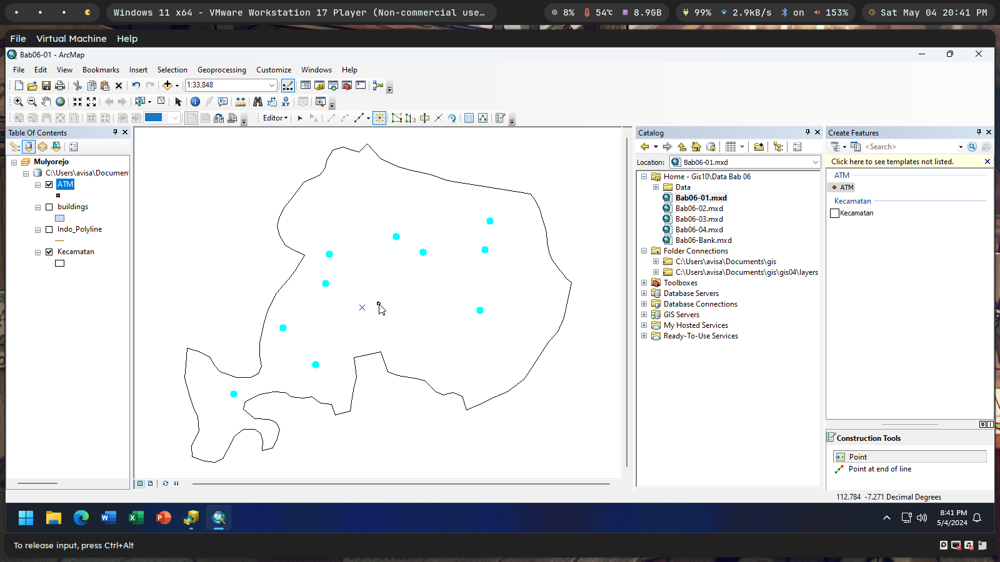

`Moh Oktavi Aziz Nugraha` `3 D3 IT-A LA` `3121521017`

# Latihan Modul GIS10 🌏

1. Buat feature class bertipe poligon untuk menyimpan fitur bank!

   

   

   

   

   

2. Masukkan beberapa fitur bank yang berada di kecamatan Mulyorejo! (Minimal
   5 data).

   

   

   

3. Buat feature class bertipe titik untuk menyimpan fitur ATM.

   

   

4. Masukkan beberapa fitur ATM yang berada di kecamatan Mulyorejo! (Minimal
   10 data).

   

   

5. Buat file shapefile bertipe garis untuk menyimpan fitur jalan di kecamatan
   Mulyorejo!.

   

   

   

6. Masukkan beberapa fitur jalan yang berada di kecamatan Mulyorejo! (Minimal
   7 data).

   > Catatan: gunakan asumsi anda sendiri dalam pengisian data.

   

   

