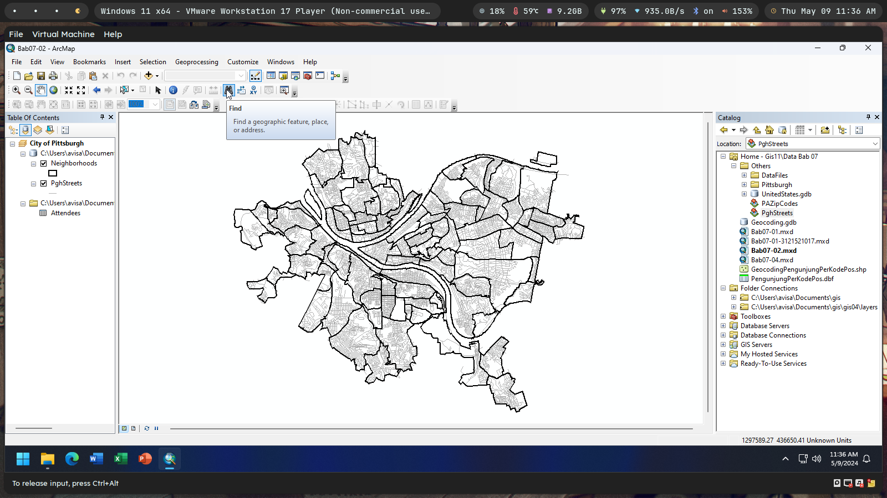
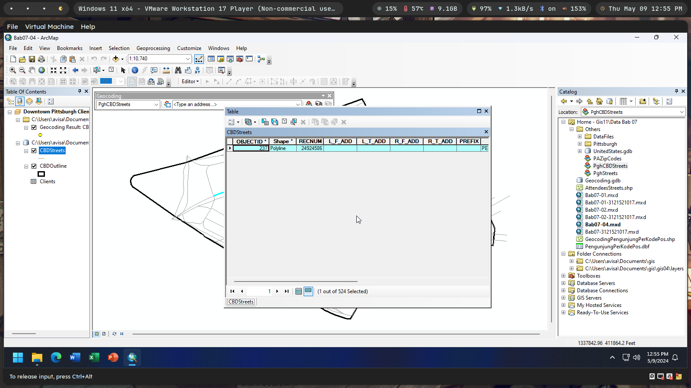

`Moh Oktavi Aziz Nugraha` `3 D3 IT-A LA` `3121521017`

# Latihan GIS11 - Geocoding 🌏

1. Hitung jumlah pengunjung acara kesenian FLUX per wilayah kode pos di
   Pennsylvania!

   

   

   

   

   

   

2. Tampilkan hasil perhitungan jumlah pengunjung dengan menggunakan
   Graduated Symbol!

   

   

   

   

   

   

   

   

   

   

   

3. Lakukan percobaan bab 7.2 sampai dengan 7.4!

   7.2.1 Mempelajari data alamat dan peta jalan

   

   

   

   7.2.2 Membuat Address Locator untuk jalan beserta zonanya

   

   

   

   

   

   

   7.2.3 Mencari alamat secara interaktif

   

   

   7.2.4 Meng-geocode data alamat ke jalan

   

   7.3.1 Memperbaiki data alamat secara interaktif

   

   7.3.2 Memperbaiki data alamat dengan menunjuk pada peta

   

   7.4.1 Membuka dokumen peta

   

   7.4.2 Membuat Address Locator untuk “CBD Streets”

   

   7.4.3 Meng-geocode alamat klien pada “CBD Streets”

   

   7.4.4 Mengidentifikasi permasalahan dengan Review/Rematch Addresses

   

   7.4.5 Memperbaiki data jalan

   

   7.4.6 Rebuild a street locator

   

   7.4.7 Penyesuaian ulang menggunakan data jalan yang telah diperbaiki

   

