`Moh Oktavi Aziz Nugraha` `3 D3 IT-A LA` `3121521017`

# Latihan GIS12 - Geocoding 🌏

### Daftar Isi

<!--toc:start-->
- [8.1 Menggunakan data query untuk meng-extract fitur](#81-menggunakan-data-query-untuk-meng-extract-fitur)
  - [8.1.1 Menggunakan perangkat Select Features untuk meng-extract fitur](#811-menggunakan-perangkat-select-features-untuk-meng-extract-fitur)
- [8.2 Meng-clip fitur](#82-meng-clip-fitur)
  - [8.2.1 Memilih fitur menggunakan Select By Location](#821-memilih-fitur-menggunakan-select-by-location)
  - [8.2.2 Meng-clip fitur](#822-meng-clip-fitur)
- [8.3 Men-dissolve fitur](#83-men-dissolve-fitur)
- [8.4 Menggabungkan (merge) beberapa fitur](#84-menggabungkan-merge-beberapa-fitur)
- [8.5 Meng-*intersect* *layer* peta](#85-meng-intersect-layer-peta)
- [8.6 Menyatukan (union) layer peta](#86-menyatukan-union-layer-peta)
- [8.7 Otomatisasi Geoprocessing menggunakan ModelBuilder](#87-otomatisasi-geoprocessing-menggunakan-modelbuilder)
  - [8.7.1 Membuat Model](#871-membuat-model)
  - [8.7.2 Menambahkan perangkat ke dalam Model](#872-menambahkan-perangkat-ke-dalam-model)
  - [8.7.3 Menjalankan (Run) Model](#873-menjalankan-run-model)
  - [8.7.4 Membuat model menjadi universal](#874-membuat-model-menjadi-universal)
<!--toc:end-->

### 8.1 Menggunakan data query untuk meng-extract fitur

Salah satu cara untuk meng-extract fitur adalah dengan mengunakan data
query. Pada latihan kali ini, anda akan belajar untuk meng-extract wilayah
kabupaten Bojonegoro dari peta wilayah kabupaten di Jawa Timur.

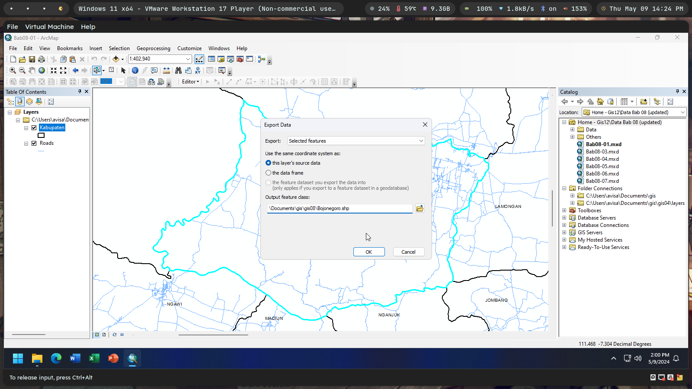

#### 8.1.1 Menggunakan perangkat Select Features untuk meng-extract fitur

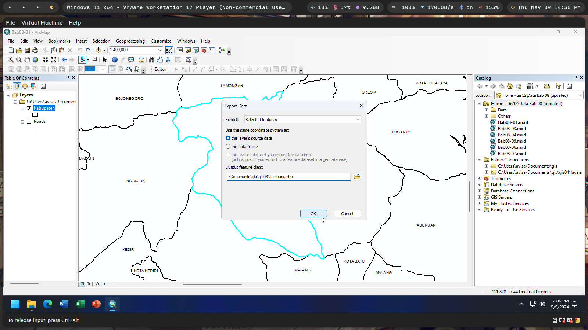

### 8.2 Meng-clip fitur

Clip merupakan proses untuk “mengambil” sebagian wilayah dari sebuah peta
dengan menggunakan layer peta lainnya sebagai “cetakan”. Pada latihan kali ini
anda akan belajar melakukan clipping peta menggunakan beberapa metode
berbeda.

#### 8.2.1 Memilih fitur menggunakan Select By Location

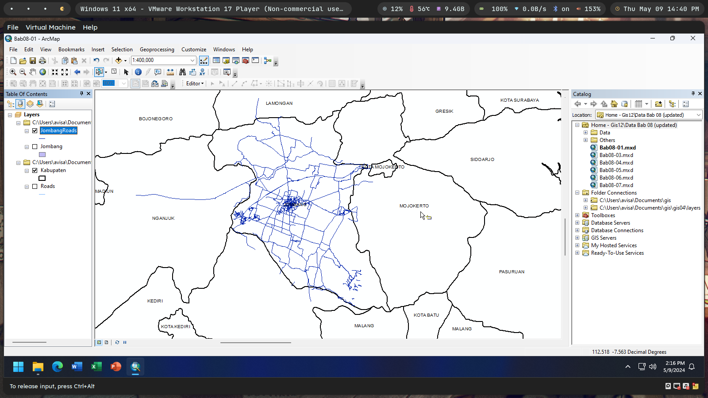

#### 8.2.2 Meng-clip fitur

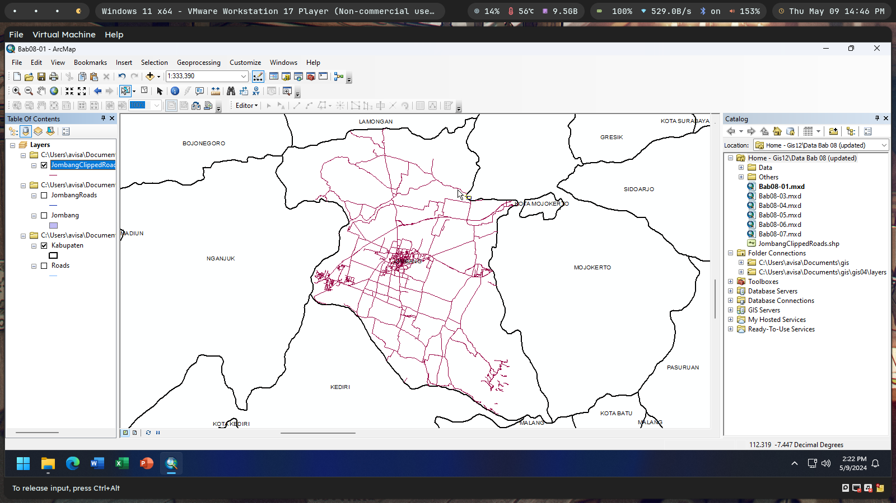

### 8.3 Men-dissolve fitur

Anda dapat menggabungkan beberapa poligon yang memiliki nilai pada kolom
data atribut yang sama menjadi sebuah poligon baru. Tipe penggabungan seperti ini
disebut sebagai dissolve. Pada latihan kali ini, anda akan membentuk sebuah
wilayah/poligon baru berdasarkan wilayah/poligon kabupaten yang memiliki kode
nomor kendaraan (kolom KodeNoPol) yang sama.

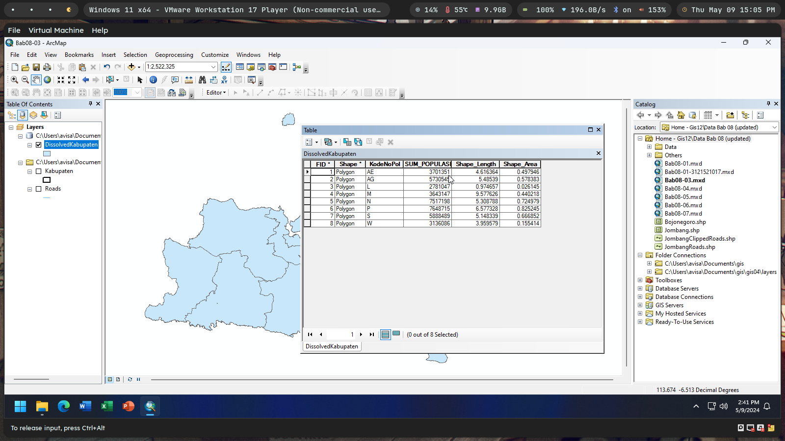

### 8.4 Menggabungkan (merge) beberapa fitur

Kadangkala, anda perlu untuk menggabungkan dua atau lebih layer peta
berbeda yang berdampingan. Proses seperti ini dapat dilakukan menggunakan
Merge. Sebagai contoh, anda mungkin perlu membuat sebuah peta bangunan yang
mencakup seluruh bangunan yang berada di tiga kecamatan di Surabaya.

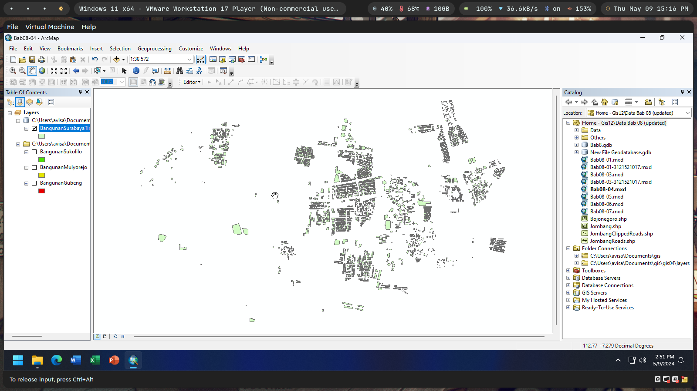

### 8.5 Meng-*intersect* *layer* peta

Perangkat intersect akan menghasilkan sebuah peta baru dari semua fitur yang
berada pada dua peta masukan yang di-overlay-kan. Sebagai contoh, anda mungkin
perlu untuk mengetahui sungai mana yang dilewati oleh setiap jalan di sebuah
wilayah, anda dapat menggunakan perangkat intersect untuk menyelesaikan hal ini.

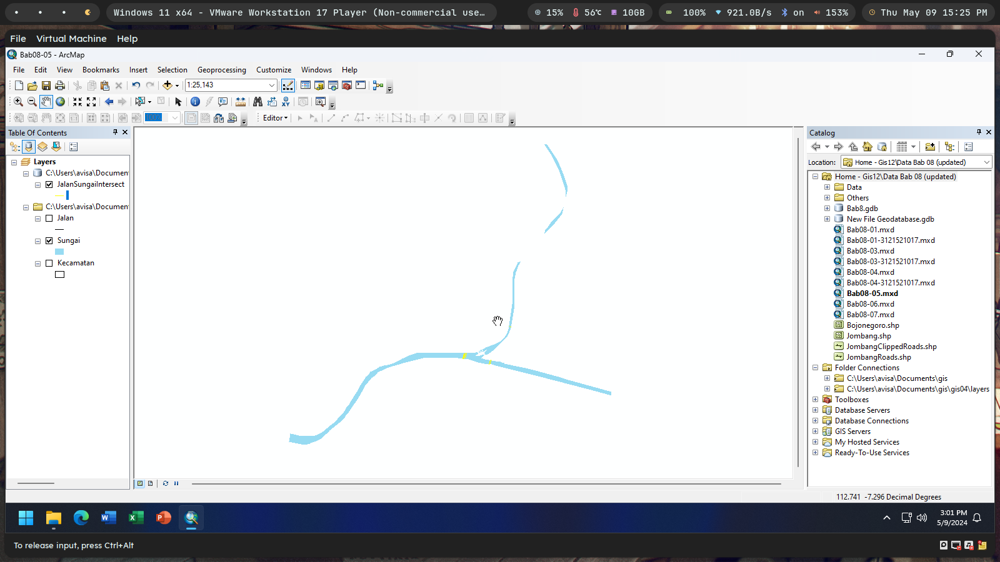

### 8.6 Menyatukan (union) layer peta

Perangkat Union akan membentuk sebuah layer poligon baru berdasarkan
penggabungan geometri dan data atribut dari dua buah layer poligon
masukan.Sebagai contoh, anda mungkin perlu menyatukan layer “KodePos”
dengan layer “Desa” untuk membentuk layer peta poligon baru.

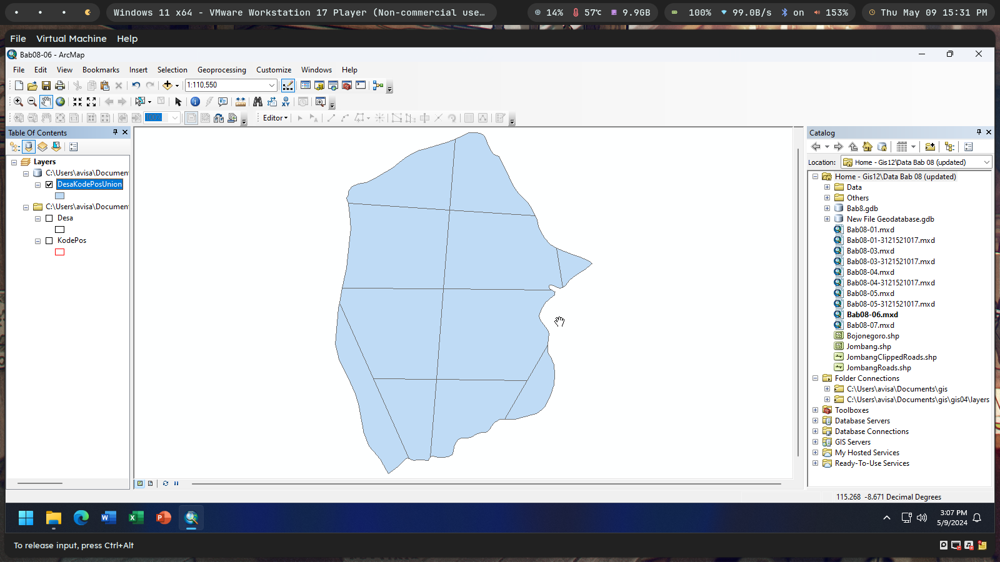

### 8.7 Otomatisasi Geoprocessing menggunakan ModelBuilder

Proses geoprocessing seringkali membutuhkan beberapa tahapan dan
melibatkan beberapa perangkat geoprocessing. Sebagai contoh, anda mungkin
perlu meng-clip layer “Jalan” menggunakan poligon yang di-extract dari layer
“Kabupaten”. Perangkat lunak ArcGIS menyediakan aplikasi ModelBuilder yang
dapat digunakan untuk membuat Macro, sebuah program yang dapat digunakan
untuk mengotomatisasikan dan mendokumentasikan alur kerja dari proses-proses
geoprocessing.

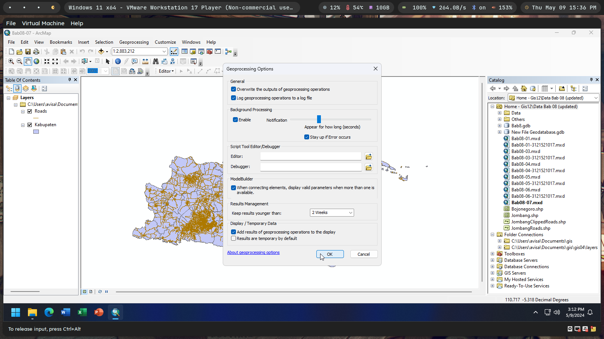

#### 8.7.1 Membuat Model

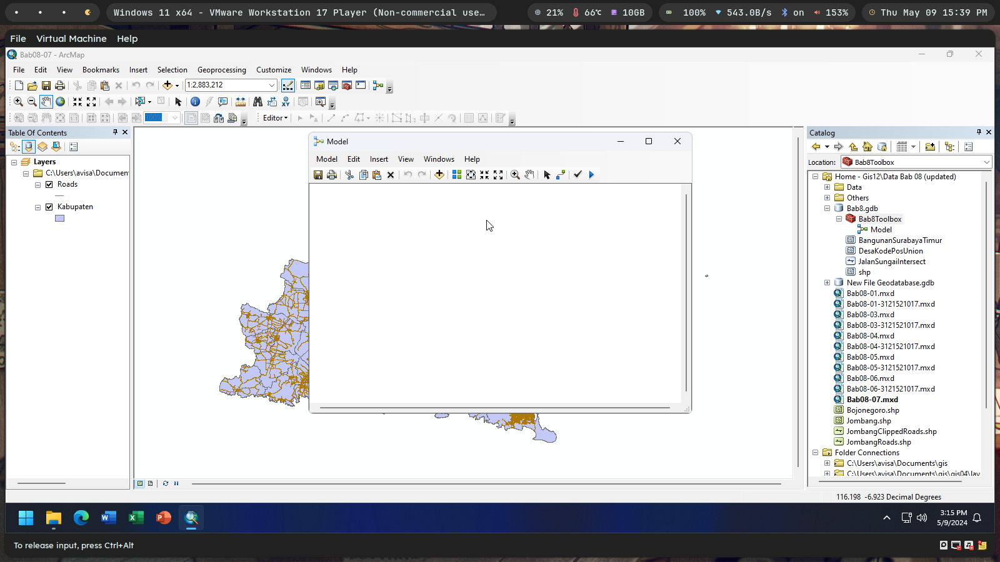

#### 8.7.2 Menambahkan perangkat ke dalam Model

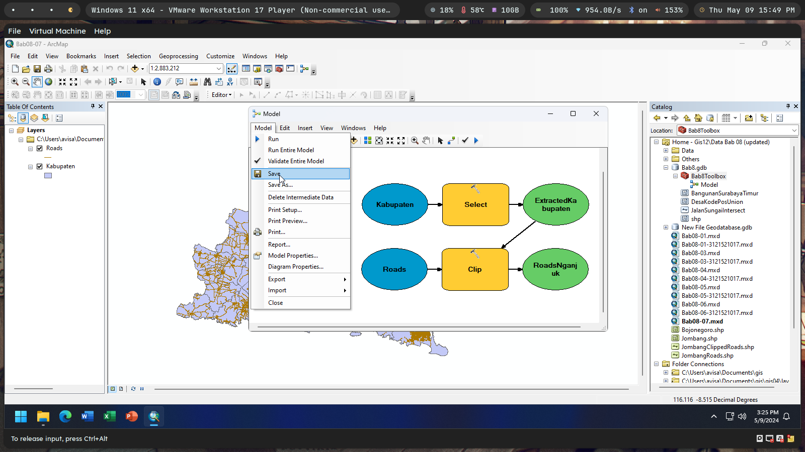

#### 8.7.3 Menjalankan (Run) Model

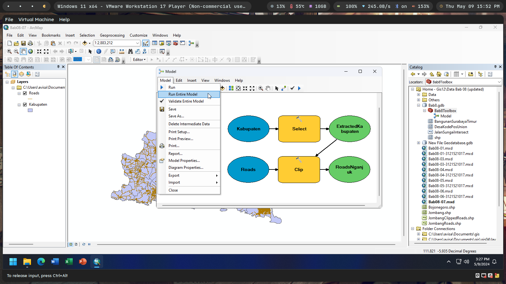

#### 8.7.4 Membuat model menjadi universal

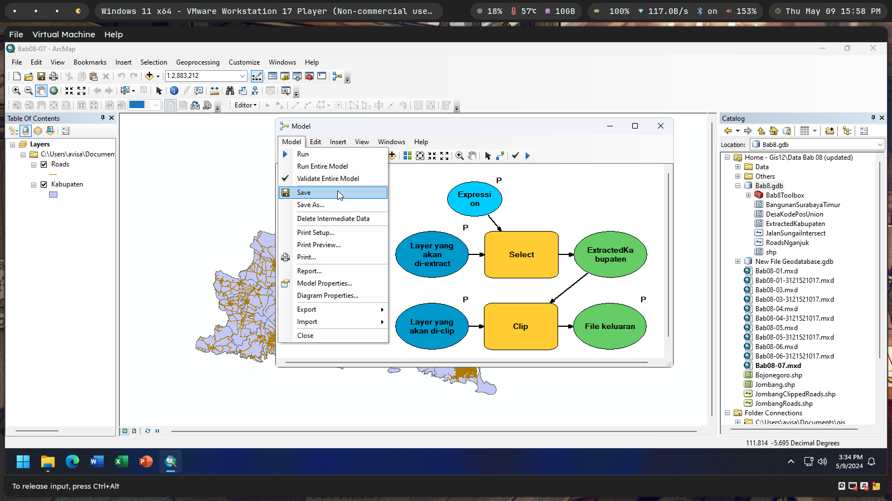

