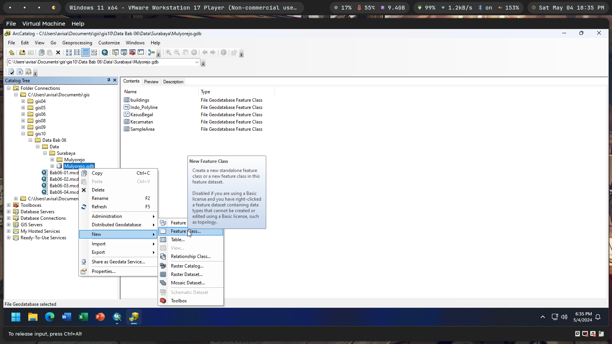

`Moh Oktavi Aziz Nugraha` `3 D3 IT-A LA` `3121521017`

# Latihan GIS11 - Geocoding 🌏

1. Hitung jumlah pengunjung acara kesenian FLUX per wilayah kode pos di
   Pennsylvania!

   

2. Tampilkan hasil perhitungan jumlah pengunjung dengan menggunakan
   Graduated Symbol!

   

3. Lakukan percobaan bab 7.2 sampai dengan 7.4!

   

